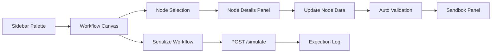
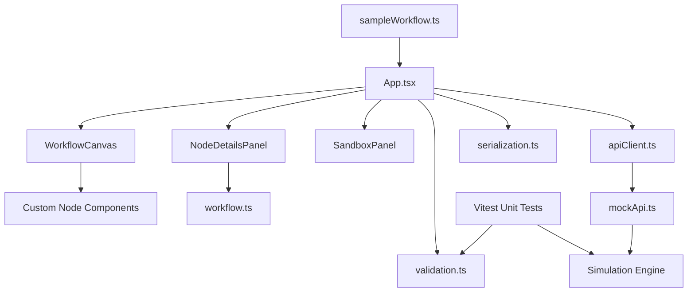

# WorkIt Documentation

## Purpose

This document explains how the WorkIt prototype addresses the Tredence Analytics case study for a mini HR Workflow Designer module.

The goal of the case study was not just to draw a graph, but to demonstrate:

- strong React fundamentals
- clean component architecture
- React Flow usage
- configurable workflow nodes
- mock API integration
- graph validation and simulation
- unit-tested workflow rules
- clear engineering reasoning

This documentation maps those expectations to the implementation in the repository.

## Case Study Summary

The requested prototype needed to support:

1. A workflow canvas built with React Flow
2. Multiple custom node types
3. Node editing forms with type-specific fields
4. A mock API for automations and simulation
5. A workflow test and sandbox area
6. Clear architecture and documentation

The final implementation approaches the problem as a graph-driven workflow builder with three major concerns:

- visual composition
- node configuration
- validation and execution

## High-Level Approach

The app is organized around a single source of truth for `nodes` and `edges` in `App.tsx`, while the rest of the codebase is split into focused modules:

- `components/canvas` handles graph creation and interaction
- `components/nodes` handles node rendering
- `components/panels` handles editing and sandbox views
- `lib` handles validation, serialization, and mock API behavior
- `types` defines the workflow domain model
- Vitest covers the core validation and simulation rules

This keeps the prototype small enough for an intern case study, but modular enough to scale.

## Requirement-by-Requirement Coverage

### 1. Workflow Canvas

### What the case study asked for

- drag nodes from a sidebar onto the canvas
- connect nodes with edges
- select a node to edit it
- delete nodes and edges
- auto-validate basic constraints

### How it was approached

The canvas is built using React Flow and wrapped with `ReactFlowProvider`. Nodes are created by dragging from the sidebar, and dropped onto the canvas with a default typed payload.

### How it is covered

- Sidebar drag source: `src/components/layout/Sidebar.tsx`
- Canvas drop handling: `src/components/canvas/WorkflowCanvas.tsx`
- Edge creation: `src/components/canvas/WorkflowCanvas.tsx`
- Selection handling: `src/App.tsx`
- Node and edge deletion: `src/components/canvas/WorkflowCanvas.tsx` and `src/App.tsx`
- Auto-validation on workflow changes: `src/App.tsx`

### Notes

The canvas supports all five required node types and includes familiar React Flow affordances such as:

- background grid
- controls
- minimap
- fit-to-view behavior

## 2. Node Types

### What the case study asked for

- Start Node
- Task Node
- Approval Node
- Automated Step Node
- End Node

### How it was approached

Each node type has:

- its own TypeScript data interface
- its own React Flow node renderer
- its own editing form section

### How it is covered

- Domain types: `src/types/workflow.ts`
- Node renderers:
  - `src/components/nodes/StartNode.tsx`
  - `src/components/nodes/TaskNode.tsx`
  - `src/components/nodes/ApprovalNode.tsx`
  - `src/components/nodes/AutomatedNode.tsx`
  - `src/components/nodes/EndNode.tsx`
- Default data factory: `src/components/canvas/defaultNodeData.ts`

### Why this matters

This structure avoids a loosely typed "one big node object" approach and makes it easier to extend the system with future node kinds.

## 3. Node Editing and Configuration Forms

### What the case study asked for

Each node type needed a dedicated editing experience, including dynamic fields for automations.

### How it was approached

The right-side `NodeDetailsPanel` switches form content based on `node.data.kind`. Each form is a controlled form that patches the active node state immediately.

### How it is covered

- Panel shell and form switching: `src/components/panels/NodeDetailsPanel.tsx`

### Field mapping by node type

#### Start Node

- Start title
- metadata key-value pairs

#### Task Node

- title
- description
- assignee
- due date
- custom fields

#### Approval Node

- title
- approver role
- auto-approve threshold
- decision mode

The auto-approve threshold is part of the simulation contract. A value greater than `0` auto-approves the node and, for branching approvals, follows the approved path. A value of `0` leaves the approval in manual/mock decision mode.

#### Automated Step Node

- title
- action selector
- action parameters generated from selected automation definition

#### End Node

- end message
- summary flag

### Why this matters

The node editor is not just a generic key-value form. It is a typed configuration surface that reflects the semantics of each workflow step.

## 4. Mock API Layer

### What the case study asked for

- `GET /automations`
- `POST /simulate`

### How it was approached

The implementation uses an endpoint-shaped in-memory API rather than a visual-only mock.

There are two layers:

- `apiClient.ts` gives the UI a request-style API surface
- `mockApi.ts` routes requests by method and path and returns mocked responses

The app wraps async API calls in `try`/`catch`/`finally` so failed mock requests do not leave the UI in a loading state. Simulation failures are represented as failed sandbox results instead of uncaught promise errors.

### How it is covered

- Client contract: `src/lib/apiClient.ts`
- Mock request router and simulation logic: `src/lib/mockApi.ts`

### Endpoints implemented

#### `GET /automations`

Returns a mocked list of automation actions such as:

- `send_email`
- `generate_doc`

Each action includes its dynamic parameter list.

#### `POST /simulate`

Accepts serialized workflow JSON and returns step-by-step execution output.

For approval nodes:

- threshold-based approvals are auto-approved when `autoApproveThreshold > 0`
- branching auto-approvals follow the `approved` handle
- branching approvals with threshold `0` use the mock manual decision behavior

### Why this matters

This design better reflects how a real frontend would talk to a backend and keeps the UI decoupled from direct implementation details.

## 5. Workflow Testing and Sandbox Panel

### What the case study asked for

- serialize the workflow
- send it to simulation
- show execution results
- validate structure

### How it was approached

The lower sandbox panel is split into three concerns:

- workflow JSON preview
- validation state
- simulation execution log

### How it is covered

- Serialization helpers: `src/lib/serialization.ts`
- Sandbox UI: `src/components/panels/SandboxPanel.tsx`
- Simulation trigger flow: `src/App.tsx`

### What the sandbox shows

- serialized workflow payload
- pass/fail validation checks
- detailed validation errors
- simulation steps with timestamps and statuses
- failed simulation responses when the mock API cannot execute the workflow

### Why this matters

This is the part of the prototype that demonstrates reasoning over graph structure rather than just graph rendering.

## 6. Validation Strategy

### What the case study asked for

Auto-validate basic constraints such as Start node correctness and graph soundness.

### How it was approached

Validation is treated as domain logic in `src/lib/validation.ts`, not as UI-specific logic.

It runs automatically when meaningful workflow structure changes, and it is also invoked again before simulation as a safety gate.

### Current validation rules

- workflow must contain exactly one Start node
- workflow must contain at least one End node
- Start node cannot have incoming connections
- Start node must connect forward
- End nodes cannot have outgoing connections
- disconnected nodes are flagged
- required fields are checked
- approval branching requires both approved and rejected paths
- cycles are not allowed

### Why this matters

The validation system now covers both:

- structural graph correctness
- node-level configuration completeness

## 7. Simulation Strategy

### How it was approached

Simulation walks the graph starting from the Start node and produces a log of executed steps.

Approval simulation supports both automatic and manual/mock decisions:

- if `autoApproveThreshold` is greater than `0`, the approval is auto-approved
- if that approval is branching, the simulation follows the `approved` path
- if the threshold is `0`, branching approval nodes randomly choose approved or rejected to keep the demo lightweight

This keeps the simulation lightweight while still proving branch-aware execution.

### How it is covered

- Simulation engine: `src/lib/mockApi.ts`

### Simulation behavior

- Start logs workflow entry
- Task logs task execution and assignee context
- Approval logs decision outcome
- Auto-approved approvals log the threshold-based auto-approval detail
- Automated step logs selected action execution
- End logs completion and stops the path

## 8. Test Coverage

### What is covered

The project includes Vitest unit tests for the pure workflow logic:

- valid sample workflow validation
- missing rejected branch detection for approval nodes
- missing required task assignee detection
- cycle detection
- auto-approved simulation path
- failed simulation when no Start node exists

### How to run tests

```bash
npm test
```

### Why this matters

Validation and simulation are the highest-value logic paths in the prototype. Testing them directly gives confidence that the graph rules and sandbox behavior remain stable as the UI evolves.

## 9. Architecture Expectations

### What the case study said it would evaluate

- clean folder structure
- separation of canvas, node, and API logic
- reusable abstractions
- scalable decomposition

### How it was approached

The current architecture favors explicit module boundaries over clever abstraction.

### Current structure

```text
src/
  components/
    canvas/
    layout/
    nodes/
    panels/
  data/
  lib/
    *.test.ts
  types/
```

### Why this structure was chosen

- it is easy to navigate
- it separates visual concerns from business logic
- it keeps React Flow logic isolated
- it keeps validation and simulation independently testable

### Scalability notes

This prototype is modular, but still intentionally lightweight. If it were extended further, the next architectural step would be extracting orchestration into custom hooks such as:

- `useWorkflowValidation`
- `useWorkflowSimulation`
- `useWorkflowDesignerState`

## Workflow Diagram



## Architecture Diagram



## Design Tradeoffs

### Why no backend persistence

The case study explicitly said no backend persistence was required, so the prototype keeps workflows in client state to focus effort on interaction quality and workflow correctness.

### Why no authentication

Authentication was intentionally excluded by the brief, which kept the prototype focused on workflow design rather than access control.

### Why use an in-memory mock API

The mock API demonstrates frontend-backend boundaries without introducing unnecessary backend setup complexity.

### Why keep validation in a plain TypeScript module

Validation rules are easier to evolve and directly unit test when they are not embedded inside UI components.

### Why ignore build output

The `dist/` directory is generated by `npm run build`, so it is ignored in Git. Reviewers and deployment systems can recreate it from the source files and lockfile.

### Dependency hygiene

Unused dependencies were removed, development tooling was updated, and `npm audit` currently reports zero vulnerabilities.

## Assumptions

- HR admins are the primary users
- workflows are modeled as directed graphs
- one Start node is the workflow entry point
- one or more End nodes are valid workflow exits
- approval branching is modeled with approved and rejected handles

## Out of Scope by Design

- authentication
- backend persistence
- database storage
- role-based access control
- audit history
- import/export

These can be added later, but they were intentionally not implemented to stay aligned with the brief and the time-boxed nature of the exercise.

## Suggested Next Improvements

If this prototype were extended beyond the assignment, the highest-value next steps would be:

1. Extract workflow orchestration into reusable hooks
2. Add local persistence or backend save/load
3. Add richer simulation controls and branch conditions
4. Improve keyboard accessibility and canvas shortcuts
5. Add import/export for workflow JSON
6. Add component-level interaction tests

## Final Assessment

This implementation covers the core functional requirements of the case study and demonstrates:

- React composition
- typed state modeling
- React Flow usage
- domain validation
- mock API integration
- graph serialization and simulation
- unit-tested validation and simulation logic
- dependency and build hygiene

Most importantly, it treats the workflow designer as a small system with clear boundaries rather than a single-page UI demo.
