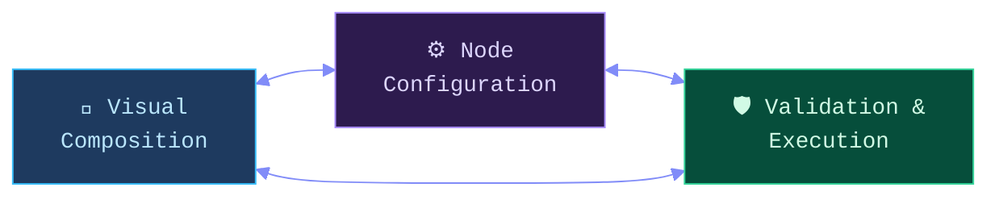
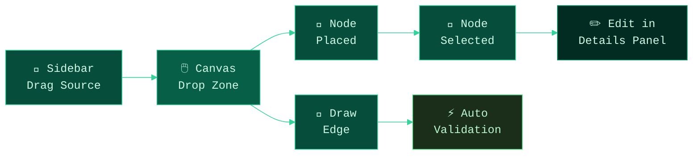
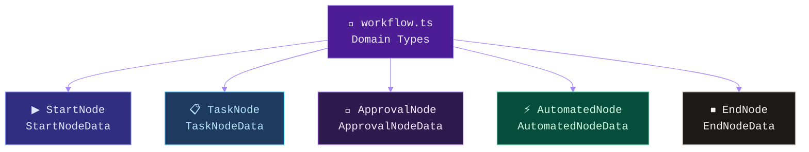
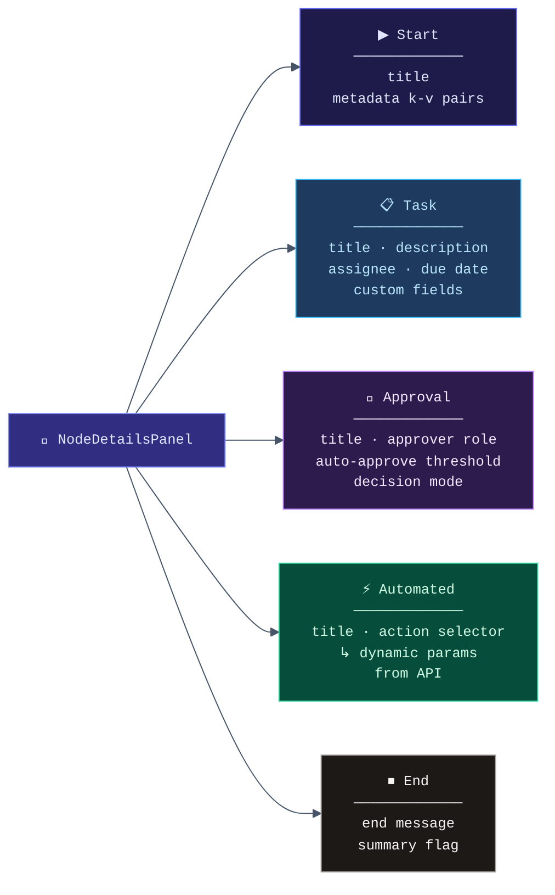
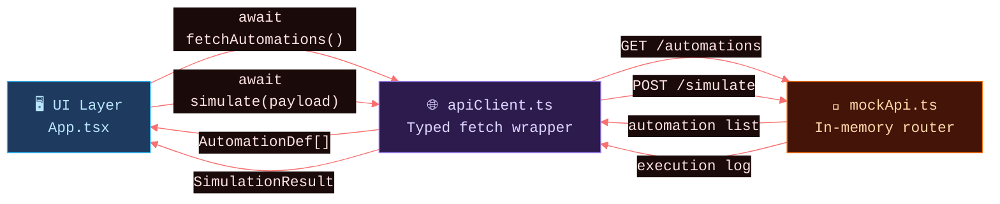
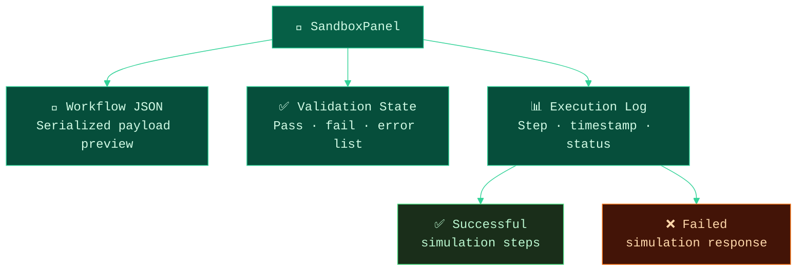
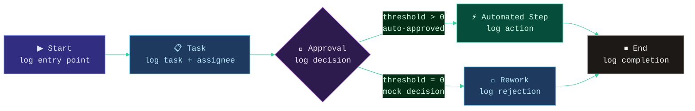
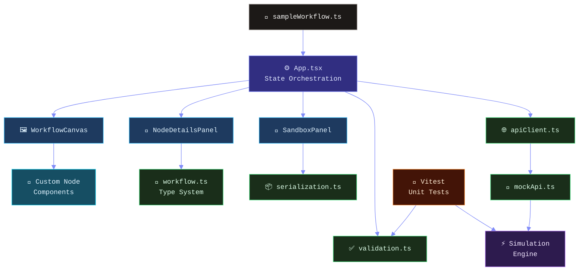
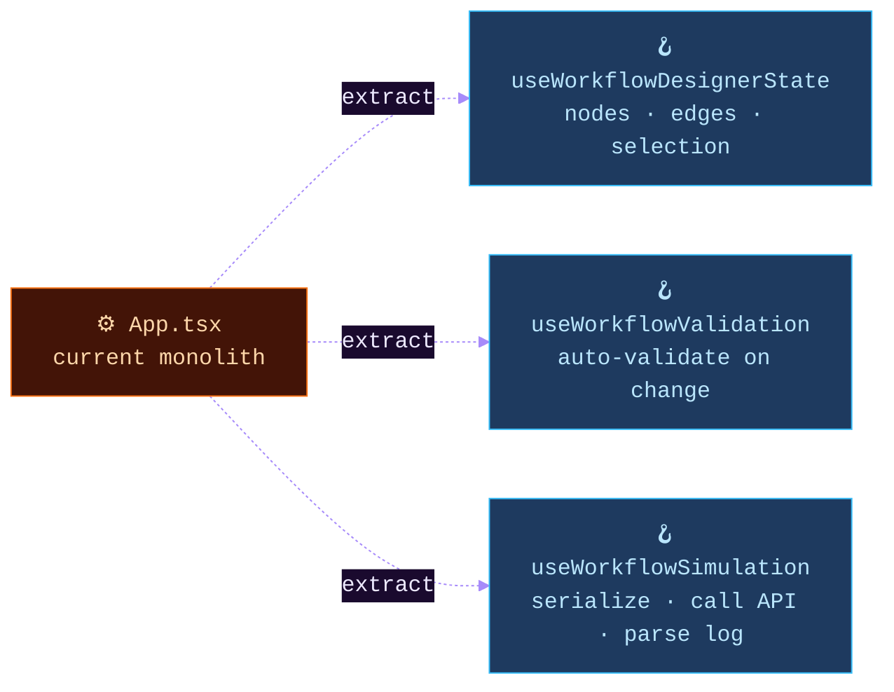

<div align="center">

<br/>

```
██████╗  ██████╗  ██████╗███████╗
██╔══██╗██╔═══██╗██╔════╝██╔════╝
██║  ██║██║   ██║██║     ███████╗
██║  ██║██║   ██║██║     ╚════██║
██████╔╝╚██████╔╝╚██████╗███████║
╚═════╝  ╚═════╝  ╚═════╝╚══════╝
```

### *Implementation Reference · Architecture Rationale · Requirement Coverage*

<br/>


<br/>

> **This document maps every case-study requirement to its exact implementation.**  
> Architecture decisions, design tradeoffs, module responsibilities, and validation strategy — all in one place.

<br/>

</div>

---

## ✦ Purpose

The WorkIt prototype was built to demonstrate:

| Dimension | What Was Evaluated |
|-----------|-------------------|
| **React fundamentals** | Controlled state, composition, lifecycle |
| **Component architecture** | Clear separation of concerns, scalable decomposition |
| **React Flow usage** | Custom nodes, edge handling, canvas interaction |
| **Node configuration** | Type-specific forms, dynamic fields |
| **Mock API integration** | Endpoint-shaped in-memory layer |
| **Validation & simulation** | DAG rules, branch-aware execution |
| **Unit tests** | Pure logic coverage with Vitest |
| **Engineering reasoning** | Decisions made explicit, not just implied |

The implementation treats the workflow designer as a **small system with clear boundaries** — not a single-page UI demo.

<br/>

---

## ✦ Three Concerns, One System



Everything flows through a single source of truth — `nodes` and `edges` state in `App.tsx` — while each concern lives in its own focused module.

<br/>

---

## ✦ Requirement 1 — Workflow Canvas

**What was asked for:** drag nodes from a sidebar, connect with edges, select to edit, delete, auto-validate.



**Where it lives:**

| Responsibility | File |
|----------------|------|
| Sidebar drag source | `components/layout/Sidebar.tsx` |
| Canvas drop handling + edge creation | `components/canvas/WorkflowCanvas.tsx` |
| Selection + deletion | `App.tsx` |
| Auto-validation trigger | `App.tsx` |

**Canvas affordances included:** background grid · controls · minimap · fit-to-view

<br/>

---

## ✦ Requirement 2 — Node Types

**What was asked for:** Start · Task · Approval · Automated Step · End



Each node type has a **dedicated TypeScript interface**, its own **React Flow renderer**, and its own **editing form section**. This avoids the "one big loosely-typed node object" antipattern and makes future extension straightforward.

**Renderers:**

| Node | Renderer |
|------|----------|
| Start | `components/nodes/StartNode.tsx` |
| Task | `components/nodes/TaskNode.tsx` |
| Approval | `components/nodes/ApprovalNode.tsx` |
| Automated Step | `components/nodes/AutomatedNode.tsx` |
| End | `components/nodes/EndNode.tsx` |
| Default data factory | `components/canvas/defaultNodeData.ts` |

<br/>

---

## ✦ Requirement 3 — Node Editing Forms

**What was asked for:** dedicated editing experience per node type, dynamic fields for automations.

`NodeDetailsPanel` switches its form content based on `node.data.kind`. Every form is a **controlled form** that patches active node state immediately — no submit button, no local form state.

**Field map by node type:**



> **Auto-approve threshold** — a value `> 0` fast-paths the approval node as approved during simulation and follows the approved branch. A value of `0` uses mock manual decision behavior.

**Where it lives:** `components/panels/NodeDetailsPanel.tsx`

<br/>

---

## ✦ Requirement 4 — Mock API Layer

**What was asked for:** `GET /automations` and `POST /simulate`



**Why two layers?** `apiClient.ts` provides the UI a typed request surface. `mockApi.ts` routes by method + path and returns mocked responses. The UI never calls mock internals directly — it would call the same `apiClient` whether the backend were real or mocked.

All async calls are wrapped with `try` / `catch` / `finally`. Simulation failures surface as **failed sandbox results** — loading state is always cleared, no uncaught promise errors.

**Endpoints:**

| Endpoint | Behavior |
|----------|----------|
| `GET /automations` | Returns `send_email`, `generate_doc` with dynamic parameter definitions |
| `POST /simulate` | Accepts serialized workflow JSON, returns step-by-step execution log |

**Where it lives:** `lib/apiClient.ts` · `lib/mockApi.ts`

<br/>

---

## ✦ Requirement 5 — Sandbox Panel

**What was asked for:** serialize workflow, send to simulation, show results, validate structure.



**Where it lives:** `lib/serialization.ts` · `components/panels/SandboxPanel.tsx` · `App.tsx`

<br/>

---

## ✦ Requirement 6 — Validation Strategy

**What was asked for:** auto-validate basic constraints — Start node correctness, graph soundness.

Validation lives in `lib/validation.ts` as **pure domain logic** — not embedded in UI components. This makes it directly unit-testable and UI-agnostic.

It runs **automatically** on workflow changes and is also invoked as a **safety gate** before simulation.

```mermaid
%%{init: {
  'theme': 'base',
  'themeVariables': {
    'primaryColor': '#1a0a2e',
    'primaryTextColor': '#ede9fe',
    'primaryBorderColor': '#8b5cf6',
    'lineColor': '#a78bfa',
    'secondaryColor': '#2e1065',
    'mainBkg': '#1a0a2e',
    'nodeBorder': '#8b5cf6',
    'clusterBkg': '#2e1065',
    'titleColor': '#c4b5fd',
    'edgeLabelBackground': '#1a0a2e',
    'fontFamily': 'monospace'
  }
}}%%
flowchart TD
    V["🛡️ validation.ts"]:::root

    V --> G["📐 Graph Structure"]:::group
    V --> N["🔧 Node Config"]:::group
    V --> C["🔄 Cycle Check"]:::group

    G --> R1["Exactly one Start node"]:::rule
    G --> R2["At least one End node"]:::rule
    G --> R3["Start has no incoming edges"]:::rule
    G --> R4["Start connects forward"]:::rule
    G --> R5["End has no outgoing edges"]:::rule
    G --> R6["No disconnected nodes"]:::rule

    N --> R7["Required fields present\non all node types"]:::rule
    N --> R8["Approval has both\napproved + rejected branches"]:::rule

    C --> R9["DFS cycle detection\nacross entire graph"]:::rule

    classDef root fill:#4c1d95,stroke:#a78bfa,color:#ede9fe
    classDef group fill:#2e1065,stroke:#7c3aed,color:#ddd6fe
    classDef rule fill:#1e1b4b,stroke:#6366f1,color:#e0e7ff
```



<br/>

---

## ✦ Requirement 7 — Simulation Strategy

The simulation engine walks the graph from the Start node and produces an ordered execution log.

**Approval node behavior:**

| `autoApproveThreshold` | Behavior |
|------------------------|----------|
| `> 0` | Auto-approved; branching follows the `approved` path |
| `= 0` | Mock manual decision; branching randomly picks approved or rejected |

**Step-by-step log output:**



**Where it lives:** `lib/mockApi.ts`

<br/>

---

## ✦ Requirement 8 — Test Coverage

All core workflow logic has **Vitest unit test** coverage. Tests target pure functions — no component rendering, no DOM.

| Test | File | What It Proves |
|------|------|----------------|
| Valid sample workflow passes | `validation.test.ts` | Happy-path baseline |
| Missing rejected branch detected | `validation.test.ts` | Approval rule enforcement |
| Missing required task assignee | `validation.test.ts` | Field-level validation |
| Cycle detection triggers | `validation.test.ts` | DAG integrity |
| Auto-approved simulation path | `mockApi.test.ts` | Branch-aware execution |
| Missing Start node → simulation fail | `mockApi.test.ts` | Safe failure mode |

```bash
npm test
```

> Validation and simulation are the highest-value logic paths in the prototype. Testing them directly gives confidence that graph rules and sandbox behavior remain stable as the UI evolves.

<br/>

---

## ✦ Architecture — Full Picture



<br/>

---

## ✦ Design Tradeoffs

| Decision | Rationale |
|----------|-----------|
| **No backend persistence** | Explicitly out of scope per the brief — effort focused on interaction quality and workflow correctness |
| **No authentication** | Excluded by brief — keeps prototype focused on workflow design |
| **In-memory mock API** | Demonstrates frontend-backend boundary without backend setup complexity |
| **Validation as plain TypeScript** | Easier to evolve and directly unit-test when not embedded in UI components |
| **`dist/` excluded from Git** | Reproducible via `npm run build` — no stale build artifacts in history |
| **Zero `npm audit` vulnerabilities** | Unused deps removed, dev tooling updated |

<br/>

---

## ✦ Scalability Notes

This prototype is intentionally lightweight. The natural next architectural step is extracting orchestration into custom hooks:



<br/>

---

## ✦ Assumptions

- HR admins are the primary users
- Workflows are modeled as directed acyclic graphs
- Exactly one Start node is the workflow entry point
- One or more End nodes are valid workflow exits
- Approval branching uses explicit `approved` and `rejected` handles

<br/>

---

## ✦ Out of Scope — By Design

> These were intentionally not implemented to stay aligned with the brief.

Authentication · Backend persistence · Database storage · Role-based access control · Audit history · Import / Export

<br/>

---

## ✦ Suggested Next Steps

If extended beyond the assignment:

1. Extract orchestration into `useWorkflowValidation`, `useWorkflowSimulation`, `useWorkflowDesignerState`
2. Add local persistence or backend save / load
3. Richer simulation controls and branch conditions
4. Keyboard accessibility and canvas shortcuts
5. Workflow JSON import / export
6. Component-level interaction tests

<br/>

---

<div align="center">

<br/>

*This document is the companion to [`README.md`](./README.md).*  
*Every section maps directly to a case-study requirement.*

<br/>


<br/>

</div>
