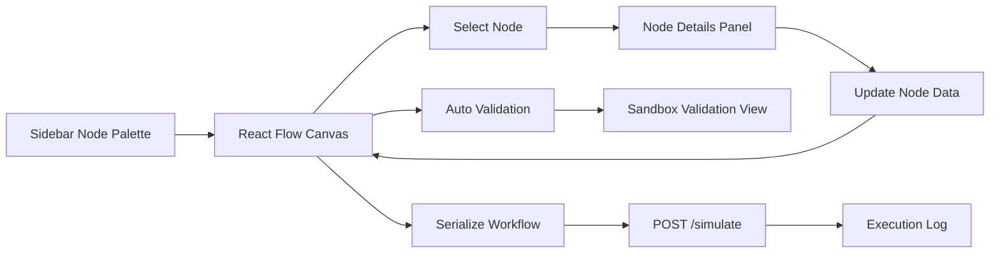
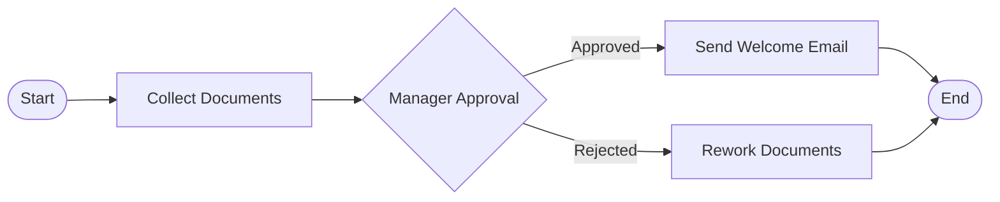
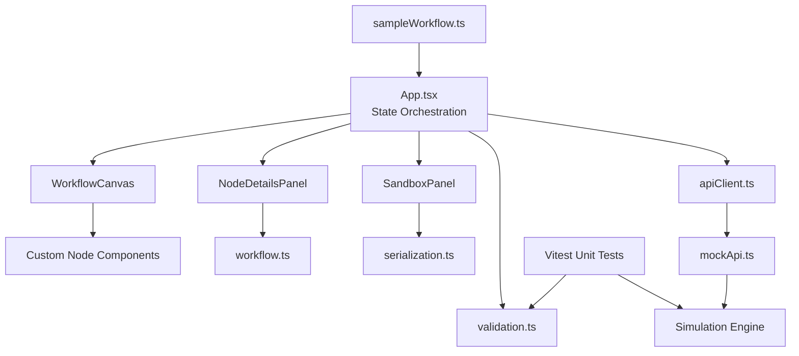

# WorkIt

WorkIt is a React + React Flow prototype for visually designing, validating, and testing internal HR workflows such as onboarding, leave approval, and document verification.

This project was built to satisfy the Tredence Analytics Full Stack Engineering Intern case study. The emphasis is on architecture, correctness, configurability, and a working sandbox rather than backend persistence or authentication.

## What This Prototype Delivers

- Drag-and-drop workflow canvas powered by React Flow
- Five workflow node types:
  - Start Node
  - Task Node
  - Approval Node
  - Automated Step Node
  - End Node
- Node-specific editing forms with controlled state
- Dynamic automation parameter forms driven by a mock API
- Real-time workflow validation
- Workflow serialization and step-by-step simulation
- In-memory endpoint-style mock API for `GET /automations` and `POST /simulate`
- Unit tests for workflow validation and simulation behavior

## Tech Stack

- React 18
- TypeScript
- React Flow
- Vite
- Tailwind CSS
- Lucide React
- Vitest

## Quick Start

```bash
npm install
npm run dev
```

Open the local Vite URL shown in the terminal.

## Available Scripts

```bash
npm run dev
npm run build
npm run lint
npm test
npm run typecheck
npm run preview
```

## Product Walkthrough

### 1. Build a workflow

- Drag nodes from the left sidebar onto the canvas
- Connect nodes to define execution order
- Click any node to edit its configuration in the right-side panel
- Delete nodes or edges with `Delete` or `Backspace`

### 2. Configure nodes

Every node type has its own form:

- Start Node: title and metadata key-value pairs
- Task Node: title, description, assignee, due date, custom fields
- Approval Node: title, approver role, auto-approve threshold, branching mode
- Automated Step Node: title, action, action parameters based on selected automation
- End Node: end message and summary flag

When an Approval Node has an auto-approve threshold greater than `0`, the sandbox simulation treats it as auto-approved and follows the approved path. A threshold of `0` keeps manual/mock decision behavior.

### 3. Validate and test

- Validation runs automatically as the workflow changes
- The `Validate` button opens the validation view explicitly
- The `Test Workflow` button serializes the graph and sends it to the mock simulation API
- The sandbox shows workflow JSON, validation feedback, and execution logs
- API interactions are wrapped with error handling so failed mock requests produce safe UI states

## Workflow Diagram



## Example Execution Flow



## Architecture



## Folder Structure

```text
src/
  components/
    canvas/
    layout/
    nodes/
    panels/
  data/
    sampleWorkflow.ts
  lib/
    apiClient.ts
    mockApi.test.ts
    mockApi.ts
    serialization.ts
    validation.test.ts
    validation.ts
  types/
    workflow.ts
  App.tsx
  main.tsx
```

## Core Design Choices

### Typed node data model

Each node type has a dedicated TypeScript interface, which keeps forms, validation, and rendering aligned.

### Separation of responsibilities

- Canvas logic lives in `components/canvas`
- Node rendering lives in `components/nodes`
- Editing and sandbox UX live in `components/panels`
- Validation, serialization, and mock API behavior live in `lib`

### Endpoint-shaped mock API

The app talks to a lightweight API client with:

- `GET /automations`
- `POST /simulate`

This keeps the mock layer close to a real backend contract while staying fully in-memory.

Async API calls are wrapped with `try`/`catch`/`finally` in the app orchestration layer. Simulation failures are surfaced as failed sandbox results, and loading state is always cleared.

### Safety-first validation

The validator checks:

- Start node presence and uniqueness
- End node presence
- Start node directionality
- End node termination
- Disconnected nodes
- Missing required fields
- Approval branching completeness
- Cycles in the graph

### Unit-tested workflow logic

The core workflow logic has Vitest coverage for:

- valid sample workflow validation
- missing approval branch detection
- missing required task fields
- cycle detection
- auto-approved simulation path
- missing Start node simulation failure

Run the tests with:

```bash
npm test
```

## Requirement Coverage

The implementation covers the main case-study requirements:

- React application: yes
- React Flow canvas: yes
- Multiple custom nodes: yes
- Configurable node forms: yes
- Mock API integration: yes
- Workflow test/sandbox panel: yes
- Unit tests for workflow logic: yes
- README and architecture explanation: yes

For a more detailed requirement-by-requirement mapping, see [DOCUMENTATION.md](./DOCUMENTATION.md).

## Assumptions and Scope

- No authentication is included, per the case-study brief
- No backend persistence is included; workflows are held in client state
- Simulation is deterministic in structure but mocked in execution behavior
- Automation actions are mocked in memory
- Production build output is generated into `dist/` and ignored by Git because it can be recreated with `npm run build`
- Current dependency audit is clean after updating development tooling

## Future Improvements

- Persist workflows locally or through a backend
- Add undo/redo history
- Add import/export for workflow JSON
- Add richer branch conditions beyond approval outcomes
- Expand tests to include component interaction and accessibility cases
- Introduce custom hooks for workflow orchestration as the app grows

## Submission Notes

This prototype is optimized for clarity, modularity, and demonstrable functionality within the time-boxed nature of the case study.

If you are reviewing this for the Tredence assignment, the best companion document is [DOCUMENTATION.md](./DOCUMENTATION.md), which maps the implementation directly to the case-study requirements.
