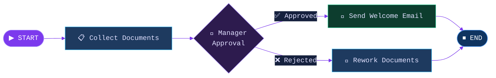
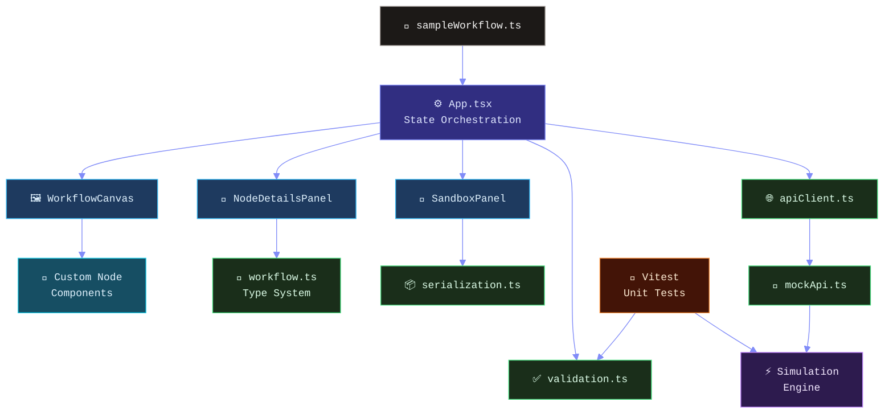
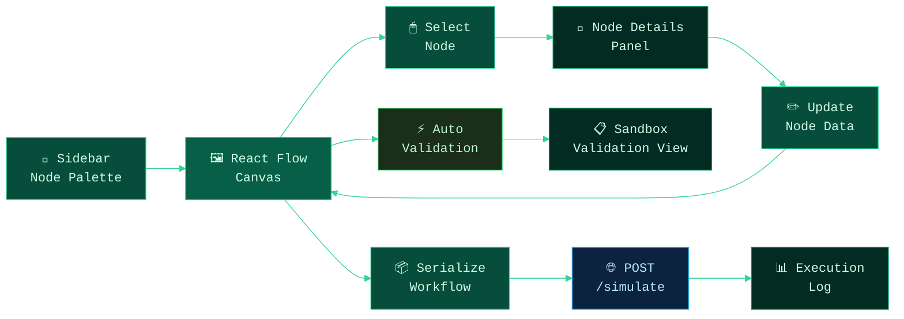
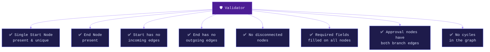

<div align="center">

<br/>

```
██╗    ██╗ ██████╗ ██████╗ ██╗  ██╗██╗████████╗
██║    ██║██╔═══██╗██╔══██╗██║ ██╔╝██║╚══██╔══╝
██║ █╗ ██║██║   ██║██████╔╝█████╔╝ ██║   ██║   
██║███╗██║██║   ██║██╔══██╗██╔═██╗ ██║   ██║   
╚███╔███╔╝╚██████╔╝██║  ██║██║  ██╗██║   ██║   
 ╚══╝╚══╝  ╚═════╝ ╚═╝  ╚═╝╚═╝  ╚═╝╚═╝   ╚═╝   
```

### *Visual HR Workflow Designer · Validator · Sandbox*

<br/>


<br/>

> **Drag. Connect. Validate. Simulate.**  
> A full-featured canvas for designing internal HR workflows — onboarding, leave approvals, document verification — with real-time validation and a step-by-step execution sandbox.

<br/>

</div>

---

## ✦ What It Does

WorkIt is a React prototype for **visually composing HR workflows** as directed graphs. It combines an interactive canvas, intelligent validation, and a mock simulation engine into a single, cohesive experience — with zero backend required.

<br/>



<br/>

---

## ✦ Node Types

| Node | Icon | Purpose |
|------|------|---------|
| **Start** | `▶` | Entry point — title & metadata key-values |
| **Task** | `📋` | Human task — assignee, due date, custom fields |
| **Approval** | `👔` | Decision gate — approver role, auto-approve threshold, branching |
| **Automated Step** | `⚡` | System action — driven by mock automation API |
| **End** | `⏹` | Terminal node — summary message & flag |

<br/>

---

## ✦ Architecture



<br/>

---

## ✦ Data Flow



<br/>

---

## ✦ Quick Start

```bash
# Install dependencies
npm install

# Start development server
npm run dev
```

Open the Vite local URL shown in your terminal.

<br/>

### All Scripts

```bash
npm run dev        # → start dev server with HMR
npm run build      # → production build → dist/
npm run preview    # → preview production build locally
npm run lint       # → ESLint
npm run typecheck  # → tsc --noEmit
npm test           # → Vitest unit tests
```

<br/>

---

## ✦ Folder Structure

```
src/
├── components/
│   ├── canvas/          ← React Flow canvas + edge config
│   ├── layout/          ← Shell, sidebar, toolbar
│   ├── nodes/           ← Custom node renderers (5 types)
│   └── panels/          ← NodeDetailsPanel + SandboxPanel
├── data/
│   └── sampleWorkflow.ts
├── lib/
│   ├── apiClient.ts     ← Typed fetch wrapper
│   ├── mockApi.ts       ← In-memory GET /automations + POST /simulate
│   ├── mockApi.test.ts
│   ├── serialization.ts ← Graph → wire format
│   ├── validation.ts    ← DAG rules + field checks
│   └── validation.test.ts
├── types/
│   └── workflow.ts      ← All node/edge interfaces
├── App.tsx              ← State orchestration root
└── main.tsx
```

<br/>

---

## ✦ Core Design Choices

**Typed node data model** — Each node type carries a dedicated TypeScript interface. Forms, validation, and rendering all derive from the same source of truth.

**Separation of concerns** — Canvas logic, node rendering, editing UX, and business logic live in distinct layers with no cross-cutting dependencies.

**Endpoint-shaped mock API** — The app speaks to a lightweight API client with `GET /automations` and `POST /simulate`, keeping the mock layer close to a real backend contract.

**Safety-first validation** — The validator checks start/end presence, directionality, disconnected nodes, missing required fields, approval branch completeness, and cycle detection.

**Auto-approve threshold** — Approval nodes with a threshold `> 0` are fast-pathed as approved during simulation. A threshold of `0` uses mock decision behavior.

<br/>

---

## ✦ Validation Rules



<br/>

---

## ✦ Unit Test Coverage

| Test Case | File |
|-----------|------|
| Valid sample workflow passes | `validation.test.ts` |
| Missing approval branch detected | `validation.test.ts` |
| Missing required task fields flagged | `validation.test.ts` |
| Cycle detection triggers | `validation.test.ts` |
| Auto-approved simulation path | `mockApi.test.ts` |
| Missing Start node simulation failure | `mockApi.test.ts` |

```bash
npm test
```

<br/>

---

## ✦ Mock API Contract

| Endpoint | Method | Description |
|----------|--------|-------------|
| `/automations` | `GET` | Returns available automation action definitions |
| `/simulate` | `POST` | Accepts serialized workflow, returns execution log |

All async calls are wrapped with `try` / `catch` / `finally`. Simulation failures surface as failed sandbox results; loading state is always cleared.

<br/>

---

## ✦ Assumptions & Scope

- **No authentication** — per the case-study brief
- **No backend persistence** — workflows live in client state only
- **Deterministic structure, mocked execution** — simulation follows graph topology faithfully
- **`dist/` excluded from Git** — reproducible via `npm run build`

<br/>

---

## ✦ Roadmap

- [ ] Local / backend workflow persistence
- [ ] Undo / redo history stack
- [ ] Workflow JSON import & export
- [ ] Richer branch conditions beyond approval outcomes
- [ ] Component interaction & accessibility test coverage
- [ ] Custom hooks for workflow orchestration

<br/>

---

<div align="center">

<br/>

*Built with precision for the Tredence Analytics Full Stack Engineering Intern case study.*  
*Companion doc: [`DOCUMENTATION.md`](./DOCUMENTATION.md) — requirement-by-requirement implementation mapping.*

<br/>


<br/>

</div>
